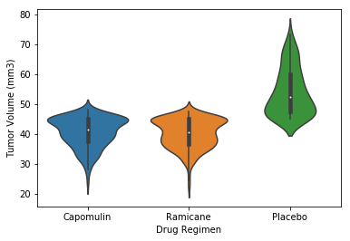

# Pymaceuticals Refactored
### By Louis Burns

* This data exploration and visualization is similar to the homework assigned to use pandas and matplotlib. Personally, I prefer seaborn for visualization so that's what I've used here.
* I've refactored both the code and the exercises.
* This is the type of homework I graded dozens of during the boot camp.


```python
# Dependencies
import seaborn as sns
import pandas as pd
import scipy.stats as st
```


```python
# Data import and join
mouse = pd.read_csv("data/Mouse_metadata.csv")
results = pd.read_csv("data/Study_results.csv")

# Double check even though we know the data has already been cleaned
print(f"Mouse shape: {mouse.shape}, Columns: {mouse.columns}")
print()
print(f"Results shape: {results.shape}, Columns: {results.columns}")
print()
print(mouse['Mouse ID'].describe())
print()

# Since the data is cleaned, the join type doesn't matter here
data = pd.merge(results, mouse, on="Mouse ID")

print(f"Merged dataframe shape: {data.shape}")
data.head()
```

    Mouse shape: (249, 5), Columns: Index(['Mouse ID', 'Drug Regimen', 'Sex', 'Age_months', 'Weight (g)'], dtype='object')
    
    Results shape: (1893, 4), Columns: Index(['Mouse ID', 'Timepoint', 'Tumor Volume (mm3)', 'Metastatic Sites'], dtype='object')
    
    count      249
    unique     249
    top       o795
    freq         1
    Name: Mouse ID, dtype: object
    
    Merged dataframe shape: (1893, 8)
    


<div>
<style scoped>
    .dataframe tbody tr th:only-of-type {
        vertical-align: middle;
    }

    .dataframe tbody tr th {
        vertical-align: top;
    }

    .dataframe thead th {
        text-align: right;
    }
</style>
<table border="1" class="dataframe">
  <thead>
    <tr style="text-align: right;">
      <th></th>
      <th>Mouse ID</th>
      <th>Timepoint</th>
      <th>Tumor Volume (mm3)</th>
      <th>Metastatic Sites</th>
      <th>Drug Regimen</th>
      <th>Sex</th>
      <th>Age_months</th>
      <th>Weight (g)</th>
    </tr>
  </thead>
  <tbody>
    <tr>
      <th>0</th>
      <td>b128</td>
      <td>0</td>
      <td>45.000000</td>
      <td>0</td>
      <td>Capomulin</td>
      <td>Female</td>
      <td>9</td>
      <td>22</td>
    </tr>
    <tr>
      <th>1</th>
      <td>b128</td>
      <td>5</td>
      <td>45.651331</td>
      <td>0</td>
      <td>Capomulin</td>
      <td>Female</td>
      <td>9</td>
      <td>22</td>
    </tr>
    <tr>
      <th>2</th>
      <td>b128</td>
      <td>10</td>
      <td>43.270852</td>
      <td>0</td>
      <td>Capomulin</td>
      <td>Female</td>
      <td>9</td>
      <td>22</td>
    </tr>
    <tr>
      <th>3</th>
      <td>b128</td>
      <td>15</td>
      <td>43.784893</td>
      <td>0</td>
      <td>Capomulin</td>
      <td>Female</td>
      <td>9</td>
      <td>22</td>
    </tr>
    <tr>
      <th>4</th>
      <td>b128</td>
      <td>20</td>
      <td>42.731552</td>
      <td>0</td>
      <td>Capomulin</td>
      <td>Female</td>
      <td>9</td>
      <td>22</td>
    </tr>
  </tbody>
</table>
</div>


```python
# Checking data types and null values
data.info()
```

    <class 'pandas.core.frame.DataFrame'>
    Int64Index: 1893 entries, 0 to 1892
    Data columns (total 8 columns):
    Mouse ID              1893 non-null object
    Timepoint             1893 non-null int64
    Tumor Volume (mm3)    1893 non-null float64
    Metastatic Sites      1893 non-null int64
    Drug Regimen          1893 non-null object
    Sex                   1893 non-null object
    Age_months            1893 non-null int64
    Weight (g)            1893 non-null int64
    dtypes: float64(1), int64(4), object(3)
    memory usage: 133.1+ KB
    


```python
# Checking the range of our numeric variables
data.describe()
```


<div>
<style scoped>
    .dataframe tbody tr th:only-of-type {
        vertical-align: middle;
    }

    .dataframe tbody tr th {
        vertical-align: top;
    }

    .dataframe thead th {
        text-align: right;
    }
</style>
<table border="1" class="dataframe">
  <thead>
    <tr style="text-align: right;">
      <th></th>
      <th>Timepoint</th>
      <th>Tumor Volume (mm3)</th>
      <th>Metastatic Sites</th>
      <th>Age_months</th>
      <th>Weight (g)</th>
    </tr>
  </thead>
  <tbody>
    <tr>
      <th>count</th>
      <td>1893.000000</td>
      <td>1893.000000</td>
      <td>1893.000000</td>
      <td>1893.000000</td>
      <td>1893.000000</td>
    </tr>
    <tr>
      <th>mean</th>
      <td>19.572108</td>
      <td>50.448381</td>
      <td>1.021659</td>
      <td>12.814580</td>
      <td>25.662441</td>
    </tr>
    <tr>
      <th>std</th>
      <td>14.079460</td>
      <td>8.894722</td>
      <td>1.137974</td>
      <td>7.189592</td>
      <td>3.921622</td>
    </tr>
    <tr>
      <th>min</th>
      <td>0.000000</td>
      <td>22.050126</td>
      <td>0.000000</td>
      <td>1.000000</td>
      <td>15.000000</td>
    </tr>
    <tr>
      <th>25%</th>
      <td>5.000000</td>
      <td>45.000000</td>
      <td>0.000000</td>
      <td>7.000000</td>
      <td>25.000000</td>
    </tr>
    <tr>
      <th>50%</th>
      <td>20.000000</td>
      <td>48.951474</td>
      <td>1.000000</td>
      <td>13.000000</td>
      <td>27.000000</td>
    </tr>
    <tr>
      <th>75%</th>
      <td>30.000000</td>
      <td>56.292200</td>
      <td>2.000000</td>
      <td>20.000000</td>
      <td>29.000000</td>
    </tr>
    <tr>
      <th>max</th>
      <td>45.000000</td>
      <td>78.567014</td>
      <td>4.000000</td>
      <td>24.000000</td>
      <td>30.000000</td>
    </tr>
  </tbody>
</table>
</div>


```python
# Create a summary statistics table for total tumor volume
summary_table = (data
    .groupby("Drug Regimen")
    .agg({"Tumor Volume (mm3)":["mean","median","var","std","sem"]})
                )
summary_table
```


<div>
<style scoped>
    .dataframe tbody tr th:only-of-type {
        vertical-align: middle;
    }

    .dataframe tbody tr th {
        vertical-align: top;
    }

    .dataframe thead tr th {
        text-align: left;
    }

    .dataframe thead tr:last-of-type th {
        text-align: right;
    }
</style>
<table border="1" class="dataframe">
  <thead>
    <tr>
      <th></th>
      <th colspan="5" halign="left">Tumor Volume (mm3)</th>
    </tr>
    <tr>
      <th></th>
      <th>mean</th>
      <th>median</th>
      <th>var</th>
      <th>std</th>
      <th>sem</th>
    </tr>
    <tr>
      <th>Drug Regimen</th>
      <th></th>
      <th></th>
      <th></th>
      <th></th>
      <th></th>
    </tr>
  </thead>
  <tbody>
    <tr>
      <th>Capomulin</th>
      <td>40.675741</td>
      <td>41.557809</td>
      <td>24.947764</td>
      <td>4.994774</td>
      <td>0.329346</td>
    </tr>
    <tr>
      <th>Ceftamin</th>
      <td>52.591172</td>
      <td>51.776157</td>
      <td>39.290177</td>
      <td>6.268188</td>
      <td>0.469821</td>
    </tr>
    <tr>
      <th>Infubinol</th>
      <td>52.884795</td>
      <td>51.820584</td>
      <td>43.128684</td>
      <td>6.567243</td>
      <td>0.492236</td>
    </tr>
    <tr>
      <th>Ketapril</th>
      <td>55.235638</td>
      <td>53.698743</td>
      <td>68.553577</td>
      <td>8.279709</td>
      <td>0.603860</td>
    </tr>
    <tr>
      <th>Naftisol</th>
      <td>54.331565</td>
      <td>52.509285</td>
      <td>66.173479</td>
      <td>8.134708</td>
      <td>0.596466</td>
    </tr>
    <tr>
      <th>Placebo</th>
      <td>54.033581</td>
      <td>52.288934</td>
      <td>61.168083</td>
      <td>7.821003</td>
      <td>0.581331</td>
    </tr>
    <tr>
      <th>Propriva</th>
      <td>52.322552</td>
      <td>50.854632</td>
      <td>42.351070</td>
      <td>6.507770</td>
      <td>0.512884</td>
    </tr>
    <tr>
      <th>Ramicane</th>
      <td>40.216745</td>
      <td>40.673236</td>
      <td>23.486704</td>
      <td>4.846308</td>
      <td>0.320955</td>
    </tr>
    <tr>
      <th>Stelasyn</th>
      <td>54.233149</td>
      <td>52.431737</td>
      <td>59.450562</td>
      <td>7.710419</td>
      <td>0.573111</td>
    </tr>
    <tr>
      <th>Zoniferol</th>
      <td>53.236507</td>
      <td>51.818479</td>
      <td>48.533355</td>
      <td>6.966589</td>
      <td>0.516398</td>
    </tr>
  </tbody>
</table>
</div>


From this table we see that the lowest median tumor volumes were through the Capomulin and Ramicane treatments. Let's do the same for the number of metastatic sites (number of tumors).


```python
# Create a summary statistics table for total tumor volume
summary_table_2 = (data
    .groupby("Drug Regimen")
    .agg({"Metastatic Sites":["mean","median","var","std","sem"]})
                )
summary_table_2
```


<div>
<style scoped>
    .dataframe tbody tr th:only-of-type {
        vertical-align: middle;
    }

    .dataframe tbody tr th {
        vertical-align: top;
    }

    .dataframe thead tr th {
        text-align: left;
    }

    .dataframe thead tr:last-of-type th {
        text-align: right;
    }
</style>
<table border="1" class="dataframe">
  <thead>
    <tr>
      <th></th>
      <th colspan="5" halign="left">Metastatic Sites</th>
    </tr>
    <tr>
      <th></th>
      <th>mean</th>
      <th>median</th>
      <th>var</th>
      <th>std</th>
      <th>sem</th>
    </tr>
    <tr>
      <th>Drug Regimen</th>
      <th></th>
      <th></th>
      <th></th>
      <th></th>
      <th></th>
    </tr>
  </thead>
  <tbody>
    <tr>
      <th>Capomulin</th>
      <td>0.713043</td>
      <td>0</td>
      <td>0.720790</td>
      <td>0.848993</td>
      <td>0.055981</td>
    </tr>
    <tr>
      <th>Ceftamin</th>
      <td>1.179775</td>
      <td>1</td>
      <td>1.402527</td>
      <td>1.184283</td>
      <td>0.088766</td>
    </tr>
    <tr>
      <th>Infubinol</th>
      <td>0.960674</td>
      <td>1</td>
      <td>1.054942</td>
      <td>1.027104</td>
      <td>0.076985</td>
    </tr>
    <tr>
      <th>Ketapril</th>
      <td>1.297872</td>
      <td>1</td>
      <td>1.942883</td>
      <td>1.393873</td>
      <td>0.101659</td>
    </tr>
    <tr>
      <th>Naftisol</th>
      <td>1.182796</td>
      <td>1</td>
      <td>1.479919</td>
      <td>1.216519</td>
      <td>0.089200</td>
    </tr>
    <tr>
      <th>Placebo</th>
      <td>1.441989</td>
      <td>1</td>
      <td>1.792449</td>
      <td>1.338824</td>
      <td>0.099514</td>
    </tr>
    <tr>
      <th>Propriva</th>
      <td>0.975155</td>
      <td>1</td>
      <td>1.174379</td>
      <td>1.083688</td>
      <td>0.085407</td>
    </tr>
    <tr>
      <th>Ramicane</th>
      <td>0.548246</td>
      <td>0</td>
      <td>0.477838</td>
      <td>0.691259</td>
      <td>0.045780</td>
    </tr>
    <tr>
      <th>Stelasyn</th>
      <td>0.872928</td>
      <td>1</td>
      <td>0.944874</td>
      <td>0.972046</td>
      <td>0.072252</td>
    </tr>
    <tr>
      <th>Zoniferol</th>
      <td>1.230769</td>
      <td>1</td>
      <td>1.559711</td>
      <td>1.248884</td>
      <td>0.092573</td>
    </tr>
  </tbody>
</table>
</div>


Ramicane and Capomulin both come out on top again with a median of zero. In the original homework, students were asked to create histograms showing the number of data points and pie charts showing the percentage of male and female. I'm more interested in drug performance since those charts didn't show anything interesting.

Let's compare those top two performers to the Placebo. To compare means, we need to use the t-test. Our basic hypothesis is that both treatments are better than the placebo at reducing overall tumor volume. Then we'll test whether Ramicane is significantly better than Capomulin based on this trial.


```python
# Construct our means
cap_means = data[data['Drug Regimen'] == 'Capomulin']['Tumor Volume (mm3)']
ram_means = data[data['Drug Regimen'] == 'Ramicane']['Tumor Volume (mm3)']
pla_means = data[data['Drug Regimen'] == 'Placebo']['Tumor Volume (mm3)']

print(f'Capomulin mean of means: {cap_means.mean()}')
print(f'Ramicane mean of means: {ram_means.mean()}')
print(f'Placebo mean of means: {pla_means.mean()}')
```

    Capomulin mean of means: 40.675741141
    Ramicane mean of means: 40.21674506671053
    Placebo mean of means: 54.03358078635359
    


```python
# Compare our means visually first
treatments = ['Capomulin', 'Ramicane', 'Placebo']
data_slice = data[data['Drug Regimen'].isin(treatments)]
sns.violinplot(x='Drug Regimen', y="Tumor Volume (mm3)", data=data_slice)
```


    <matplotlib.axes._subplots.AxesSubplot at 0x1dd293e77b8>





```python
# Test Capomulin against the placebo
# Since the variances weren't homogenous, we indicate such
st.ttest_ind(cap_means, pla_means, equal_var=False)
```


    Ttest_indResult(statistic=-19.99251564749819, pvalue=1.5647382727825386e-56)


Since we have a p-value of 1.5 e-5, we can reject the null hypothesis that the means are the same. Let's go on to see if Ramicane is statistically better than Capomulin.


```python
st.ttest_ind(ram_means, cap_means, equal_var=False)
```


    Ttest_indResult(statistic=-0.9980996664586762, pvalue=0.31876061261381256)


Since the p-value is 0.3, we cannot reject the null hypothesis that the two treatments are statistically different. Let's quickly check the same thing for metastatic sites.


```python
cap_sites = data[data['Drug Regimen'] == 'Capomulin']['Metastatic Sites']
ram_sites = data[data['Drug Regimen'] == 'Ramicane']['Metastatic Sites']

print(f'Capomulin mean of sites: {cap_sites.mean()}')
print(f'Ramicane mean of sites: {ram_sites.mean()}')

st.ttest_ind(ram_sites, cap_sites, equal_var=False)
```

    Capomulin mean of sites: 0.7130434782608696
    Ramicane mean of sites: 0.5482456140350878
    


    Ttest_indResult(statistic=-2.2788473238306826, pvalue=0.02315506402085276)


### Discussion

Here we can see that with a p-value of 0.02, we can reject the null hypothesis after all. Both treatments are significantly better than the placebo. And Ramicane is significantly better than Capomulin if you compare the number of metastatic sites over and above the total tumor volume. What that means is that with one treatment you get fewer but bigger tumors and with the other you get more tumors but smaller in volume.

The original homework had the students compare the means of four in a boxplot, Capomulin in a line chart (volume over time - it decreased), and plot a regression line showing that as mouse weight increased, so did the tumor volume. Those are all fairly intuitive (if not obvious) results so I don't replicate them here. 

Credit: The tumor volume statistics summary table was from the assignment. The rest is my own work.
